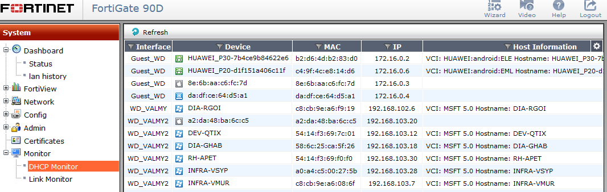

# DHCP command

## Get dhcp lease

- Get the current dhcp lease list :
```
execute dhcp lease-list
execute dhcp6 lease-list
```

To get the same result with Web gui :
- Go to Monitor > DHCP monitor :



## Clear dhcp lease

- Use this command to clear specific ip DHCP address leases :
```
execute dhcp lease-clear <ip_address>
execute dhcp6 lease-clear <ip_address>
```

- Use this command to clear all DHCP address leases :
```
execute dhcp lease-clear all
execute dhcp6 lease-clear all
```

## show dhcp server config

```
show system dhcp server
```

## set static ip assignment on dhcp server :

- old method :
```
config system dhcp server
    edit <DHCP ID>
      config reserved-address
        edit <ip_range_id>
          set ip <ip_addr>
          set mac <mac_addr>
    end
```
with :
- <dhcp_id> : Enter an ID for the DHCP server.
- <ip_range_id> : Enter the ID for the DHCP excluded IP range that should not be assigned.

- new method :
```
config system dhcp reserved-address
   edit <name_str>
     set ip <address_ipv4>
     set mac <address_hex>
     set type {regular | ipsec}
   end
```

## Source :

- [fortinet cli guide for dhcp lease-list](https://help.fortinet.com/fvox/cli-html/2-2-0/index.html#page/FortiVoice%20Online%20CLI%20Reference/execute.4.08.html)
-  [debug fortinet dhcp issue](https://community.fortinet.com/t5/FortiGate/Technical-Tip-Diagnosing-DHCP-on-a-FortiGate/ta-p/192960?externalID=FD30879)
- [Reserving a DHCP IP address for a particular MAC address (IP/MAC binding)](https://community.fortinet.com/t5/FortiGate/Technical-Note-Reserving-a-DHCP-IP-address-for-a-particular-MAC/ta-p/197997?externalID=13076)