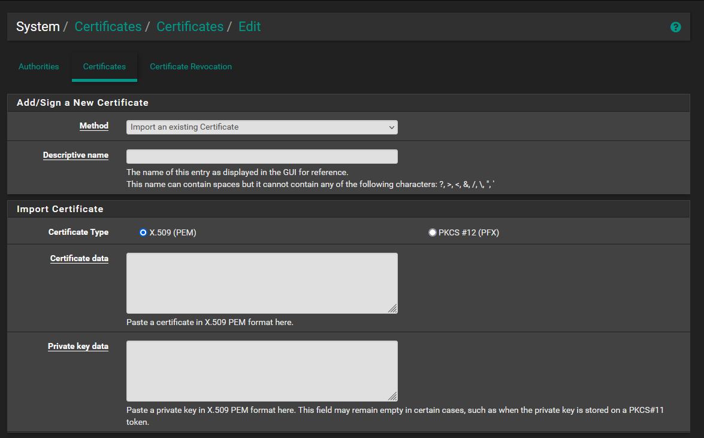

# pfsense certificate configuration

## Description 

This document describe the procedure to install a certificate on pfsense

## Install existing certificate 

- Go to : System / Certificates / Edit
- Choose the "import" method :  "Import existing Certificate" 

- import certificate : copy certificate infos (file ending with ".crt", i.e: "webdrone.fr.crt")
- import certificate key : copy key (file ending with ".key", i.e : "webdrone.key")

## Install certificate with Let's encrypt plugin 

@TODO

## Source : 

- [Pfsense documentation about Certificate management](https://docs.netgate.com/pfsense/en/latest/certificates/index.html)